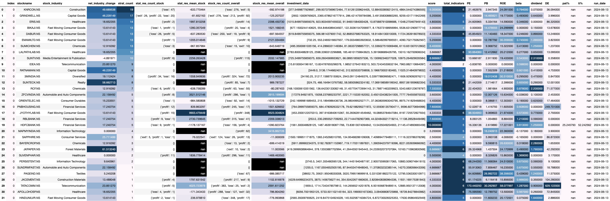

# Swing_trading

## Table of Contents
- [Swing\_trading](#swing_trading)
  - [Table of Contents](#table-of-contents)
  - [Introduction](#introduction)
  - [Features](#features)
  - [Installation](#installation)
  - [Usage](#usage)
  - [License](#license)
  - [Acknowledgements](#acknowledgements)
  - [Word from me](#word-from-me)


## Introduction

This Repository uses simple moving average (SMA) crossovers to select stocks in Nifty500. The SMAs are selected after backtesting on last 3 years of data. We use yfinance to download the data. 

Why SMA crossover?

We tested different technical indicators like RSI, Support resistance, etc. SMA crossover gave the best results after backtesting. 

The SMA results are posted daily on my discord group mentioned below:
https://discord.gg/ZWKJ6FXM

## Features

Below is an example of the result that is published to discord daily



1) **stockname:** The name of the stock.
2) **stock industry:** Industry of that stock.
3) **net_industry_change:** Percentage change in that industry(nifty 500 stocks only) in last 20 days 
4) **strat_count:** number of different SMA crossovers on which stock is listed today.
5) **strat_res_count_stock:** Stock performance results for last 1 year on current start_count SMA strategies.
6) **stat_res_mean_stock** Average profit made on start_count SMA strategies.
7) **stock_res_count_overall:**  Stock performance results for last 1 year on all SMA strategies.
8) **stock_res_mean_overall:** Average profit made on all SMA strategies.
9) **investment_data:** An array that represents [entry, stop_loss, gap_between_entry_&_SL,buy_quantity, exit]
10) **score:** Overall average fundamental score of the stock (out of 10) based on the below fundamentals.
11) **total_indecators:** Total number of fundamental indicators available for the stock (out of 8).
12) **PE:** PE ratio of the stock.
13) **PB:** PB ratio of the stock.
14) **ROE:** ROE (Return on Equity) of the stock.
15) **beta:** Beta value of the stock.
16) **dividend:** Dividend of the stock.
17) **DE:** Debt to Equity ratio of the stock.
18) **pat%:** PAT percentage growth of the stock.
19) **ti%:** total income growth of the stock.
20) **run_date:** Pipeline run date.

## Installation

```
    git clone: https://github.com/daivikbhatia/swing_trading.git 
    cd project-name
```


## Usage

Put your own discord bot token in discord_bot.py
Run main_run.sh to run the essential scripts that will generate the image dataframe.

## License

We use GNU GENERAL PUBLIC LICENSE

[Link to License](LICENSE)

## Acknowledgements

1) **Yfinance library:** Thankyou for providing free realtime stock data for almost all stocks out there!
2) Thanks to late night boredom and financial independency dream to kickstart this project.

## Word from me

I started this project because of passion for coding, data science, and trading. I take daily trades from my discord channel based on this project and additional analysis. So far the trades taken from this have been profitable for me. THIS IS NOT A TRADING TIP or ADVICE. My dream for this project is to add a lot more functionality, features and usecases.

Happy coding!